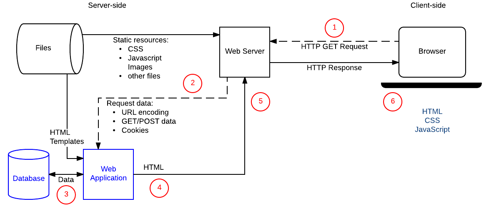

# Administració de servidors web

## 1. Fonaments dels servidors web

A diferència de les aplicacions d'escriptori, que utilitzen els recursos d'un únic ordinador
*les aplicacions web són distribuïdes*, intervenen com a mínin dos equipos diferents: el client i el servidor.

La comunicació és du a terme mitjançant el protocol HTTP, base
de la _World Wide Web_.

L’**arquitectura client-servidor** és un model de comunicació on **dos tipus d’ordinadors o processos tenen rols diferenciats**:

- **Client:** fa peticions de serveis o recursos (com un navegador web que demana una pàgina).
- **Servidor:** rep les peticions dels clients, les processa i retorna les respostes (com un servidor web que envia les pàgines sol·licitades).

El funcionament bàsic és el següent:

1. El client inicia la connexió.  
2. El servidor atén la petició.  
3. El servidor retorna la resposta al client.  

!!! importat "Conceptes clau"

      - Comunicació mitjançant **protocols de xarxa** (com HTTP).  
      - **Centralització dels recursos i dades** al servidor.  
      - **Escalabilitat**: es poden afegir més clients o més servidors segons les necessitats.  

### El protocol HTTP

El protocol de transferència d'hipertext (HTTP) és un protocol
client-servidor molt senzill que articula els intercanvis d'informació
entre els clients HTTP (navegadors) i els servidors HTTP.

**HTTP es basa en operacions senzilles de sol·licitud/resposta.** Quan
un client estableix una connexió amb un servidor i envia un missatge amb
les dades de la sol·licitud, el servidor respon amb un missatge similar
que conté l'estat de l'operació i el seu resultat de la sol·licitud.
Totes les operacions poden adjuntar un objecte o recurs sobre el qual
actuen; cada objecte web (document HTML, arxiu multimèdia o aplicació
CGI) és conegut pel seu localitzador uniforme de recursos (URL, _Uniform
Resource Locator_). Els recursos poden ser arxius, el resultat de
l'execució d'un programa, una consulta a una base de dades, la
traducció automàtica d'un document, etc.

**HTTP és un protocol sense estat**, és a dir, no guarda cap informació
sobre connexions anteriors. El desenvolupament d'aplicacions web
freqüentment necessita mantenir estat. Per això s'utilitzen les galetes
(_cookies_), és a dir, la informació que un servidor pot emmagatzemar en
el sistema client. Això permet que les aplicacions web institueixin la
noció de "sessió", i, alhora, permet rastrejar usuaris, ja que les
galetes es poden emmagatzemar en el client durant un temps indeterminat.

Per a conèixer amb més profunditat el protocol HTTP  avaluarem en què consisteix una transacció HTTP. Cada vegada que un client fa una petició a un servidor, s'executen un
seguit d'accions:

1. Un usuari accedeix a una adreça d'Internet (URL) seleccionant un
    enllaç d'un document HTML o introduint-la directament a la barra de
    navegació d'un navegador web des de la perspectiva del client web.
    El client web descodifica l'adreça d'Internet (URL) separant-ne les
    diferents parts. És així com s'identifiquen el protocol d'accés,
    el node, expressat amb el nom de domini o la seua adreça IP, el
    possible port opcional (el valor per defecte és el 80) i l'objecte
    del servidor requerit.
2. S'obre una connexió TCP/IP amb el servidor cridant el port TCP
    corresponent. Es fa la petició. En conseqüència, s'envien l'ordre
    necessària (GET, POST, HEAD, etc.), l'adreça de l'objecte requerit
    (el contingut de l'adreça d'Internet del servidor), la versió del
    protocol HTTP utilitzada (en la major part de les ocasions és
    HTTP/1.1) i un conjunt variable d'informació que inclou dades sobre
    les capacitats del navegador web, dades opcionals per al servidor,
    etc.
3. El servidor localitza el recurs sol·licitat i torna la resposta al
    client.
4. Aquesta resposta consisteix en **un codi d'estat** i **el tipus de dada**
    amb extensions multipropòsit de correu d'Internet (MIME,
    Multipurpose Internet Mail Extension) de la informació de tornada,
    seguit de la mateixa informació.
5. El client formata i mostra el recurs rebut.
6. Es tanca la connexió TCP.

!!! important
    Aquest procés es repeteix en cada accés que es faça al servidor HTTP.
    Per exemple, si es recull un document HTML que conté quatre imatges, el
    procés de transició mostrat amb anterioritat es repeteix cinc vegades,
    és a dir, una pel document HTML i quatre per les imatges.

<figure markdown>

<figcaption>Etapes d'una transacció HTTP</figcaption>
</figure>
Si el recurs sol·licitat és un programa (CGI, ASP.NET, PHP, etc.) el
servidor HTTP redirigirà la petició a la llibreria o intèrpret adequat
que executarà el programa i tornarà el control al servidor web.

<figure markdown>

<figcaption>Etapes d'una sol·licitud HTTP amb processament per part del servidor
</figure>

### Format de les URL

La sintaxi general de les URL consisteix en una seqüència jeràrquica de
5 components:

    URI = scheme:[//authority]path[?query][#fragment]

on el component `authoriry` es deivideix en tres subcomponents:

    authority = [userinfo@]host[:port]

<figure markdown>

<figcaption>Sintaxi de les URL</figcaption>
</figure>

- Tipus MIME  
- Navegadors web: paràmetres d'aparença i ús  

## 2. Configuració bàsica i avançada

- Fitxers de configuració i/o ferramentes de configuració  
- Configuració avançada del servidor web  
- Mòduls: instal·lació, configuració i ús  
- Amfitrions virtuals: creació, configuració i utilització  

## 3. Seguretat en servidors web

- Autenticació i control d’accés  
- El protocol HTTPS  
- Certificats. Servidors de certificats  
- Configuració segura de servidors HTTP  

## 4. Desplegament d’aplicacions

- Desplegament d’aplicacions sobre servidors web  
- Desplegament de servidors web mitjançant tecnologies de virtualització, en el núvol i en contenidors  

## 5. Gestió i manteniment

- Conjunts d’eines de gestió de logs: instal·lació, configuració i utilització, per a l’ajuda en la presa de decisions (Big Data)  
- Documentació  
